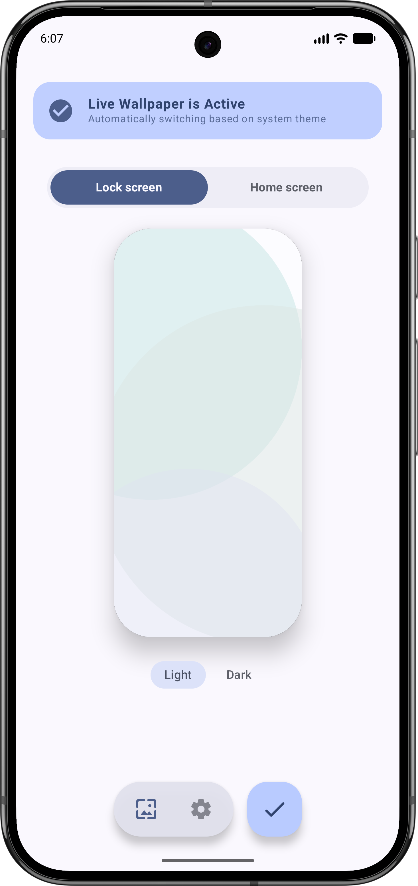
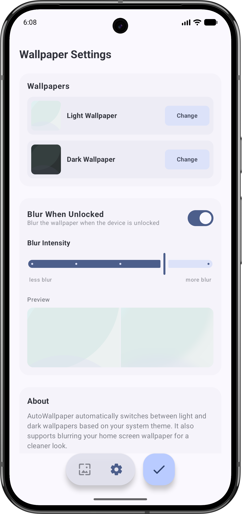

# AutoWallpaper

AutoWallpaper is a modern Android application that automatically switches your device's wallpaper between light and dark themes. It features a clean Material 3 design, dynamic color support, and advanced blurring effects for a premium home screen experience.

## Features

- **Automatic Theme Switching**: Automatically changes your wallpaper when your system switches between Light and Dark modes.
- **Home Screen Blurring**: Apply a subtle, customizable blur to your home screen wallpaper to make your icons and widgets pop while keeping the lock screen sharp.
- **Material You / Dynamic Colors**: Fully supports Android 12+ dynamic color schemes, adapting its UI to your current wallpaper colors.
- **Generated Backgrounds**: Includes a beautiful, programmatically generated "Material Blob" background that adapts to your theme colors.
- **Integrated Cropping**: Built-in integration with the Android system cropping tool to ensure your wallpapers fit perfectly on your display.
- **Modern UI**: Features a fluid, floating navigation bar and a clean, gesture-friendly interface.

## Screenshots

  
  

## Installation

1. Download the latest APK from the **Releases** section on GitHub.
2. Install the APK on your Android device (Android 7.0+ supported, Android 12+ recommended for dynamic colors).
3. Follow the in-app instructions to set AutoWallpaper as your active live wallpaper.

## Requirements

- Android 7.0 (API 24) or higher.
- Live Wallpaper support on the device.

## License

This project is licensed under the MIT License - see the LICENSE file for details.
